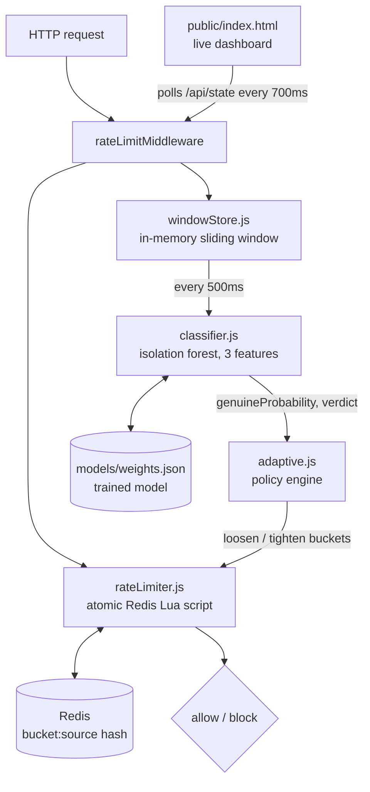

# Traffic Shield

**Distributed rate limiter with an AI-driven adaptive traffic classifier.**

A server can't always tell a genuine flash-sale rush from a scripted attack just by counting requests. Traffic Shield rate-limits every source with a Redis-backed token bucket, then uses a trained classifier watching traffic shape (timing, source diversity, endpoint variety) to decide in real time whether to loosen the limits for a real surge or clamp down on a suspicious one.

This is a real, running system: an Express API, a Redis-backed distributed token bucket (atomic via a Lua script), an isolation forest anomaly detector trained on synthetic traffic, an adaptive policy loop, and a live dashboard.


## Architecture



## How the pieces work

**1. Token bucket (src/rateLimiter.js)**
Every source (IP or user id) gets a bucket: a capacity and a refill rate. Checking and consuming a token happens as a single Redis Lua script (EVAL), so the read-modify-write is atomic even under concurrent requests from multiple app server instances.

**2. Feature extraction (src/features.js)**
Over a rolling window of recent requests, three signals are computed:
- Timing regularity: coefficient of variation of inter-arrival times per source. Bots fire at near-fixed intervals (low CV); humans are irregular (high CV).
- Source diversity: unique sources divided by total requests. A flash sale has many different users; an attack usually comes from very few.
- Endpoint diversity: unique endpoints divided by total requests. Genuine users browse around; attackers hammer one endpoint (e.g. /login).

**3. Classifier (src/classifier.js + src/isolationForest.js + scripts/trainClassifier.js)**
An isolation forest (Liu, Ting & Zhou, 2008) over those 3 features. Isolation forest is an unsupervised anomaly detector: it builds many random trees that recursively split the data on a random feature/threshold, and measures how many splits it takes to isolate a point. Points in dense, "normal" clusters take many splits to isolate (long average path length); outliers get isolated in just a few (short average path length). Crucially, the forest is trained only on genuine-shaped traffic, it never sees an attack example during training, which mirrors real deployments where you rarely have a labeled attack dataset up front but you do know what normal traffic looks like.

Training generates synthetic genuine-traffic feature vectors from documented behavioral assumptions (see comments in trainClassifier.js). A separate labeled synthetic set (genuine + attack) is generated afterward only to calibrate the raw anomaly score into a genuineProbability and report accuracy (~97%+ on held-out synthetic data). That labeled data never touches the forest itself.

**4. Adaptive policy (src/adaptive.js)**
Every 500ms, the classifier's verdict updates the live policy:
- genuine_surge: global bucket capacity/refill rate doubles.
- attack_detected: the specific high-volume, low-diversity source(s) get clamped hard while everyone else stays on normal limits.
- otherwise: limits relax back to defaults.

## Project structure

- src/server.js - Express app, routes, classification loop
- src/rateLimiter.js - Redis-backed token bucket (Lua script)
- src/redisClient.js - ioredis connection
- src/windowStore.js - in-memory sliding window of requests
- src/features.js - feature extraction (timing/source/endpoint)
- src/isolationForest.js - isolation forest (build trees, score anomalies)
- src/classifier.js - loads trained model, scores traffic
- src/adaptive.js - policy engine (loosen/tighten)
- scripts/trainClassifier.js - trains the isolation forest on synthetic genuine traffic
- scripts/simulateTraffic.js - sends real HTTP traffic (flashsale/attack/mixed)
- models/weights.json - trained isolation forest model (generated, committed for convenience)
- public/ - dashboard (vanilla HTML/CSS/JS, polls the real API)
- tests/ - unit tests for the token bucket (node:test)

## Running it locally

Requirements: Node 18+, Redis running locally (or update REDIS_URL).

```bash
# 1. Install Redis (skip if you already have it)
sudo apt-get install redis-server   # or: brew install redis
redis-server --daemonize yes

# 2. Install dependencies
npm install

# 3. Set up environment
cp .env.example .env

# 4. Train the isolation forest (writes models/weights.json)
npm run train

# 5. Start the server
npm run dev
# -> http://localhost:3000/index.html
```

Demo it: open the dashboard, then in another terminal:

```bash
npm run simulate:flashsale   # many users, varied pages, jittered timing
npm run simulate:attack      # few sources, /login only, fixed-interval firing
npm run simulate:mixed       # both at once
```

Run tests:
```bash
npm test
```

## What this covers (and is honest about)

- Real distributed rate limiting via an atomic Redis Lua script, the same pattern used in production rate limiters.
- A real, trained isolation forest (not hardcoded if/else thresholds) making the genuine/attack call, with visible feature scores.
- An unsupervised anomaly detector, trained only on what "normal" traffic looks like, never on attack examples, which is the realistic constraint most teams actually face.
- A closed-loop adaptive system, classification actually changes enforcement live.
- The forest is trained on synthetic genuine-traffic data (documented in trainClassifier.js), since there's no labeled real-world dataset for this. That's a legitimate, common bootstrapping approach, just don't claim it learned from real attack traffic.
- windowStore.js is in-memory, so the classifier's view of "recent traffic" is per-process. Fine for one server; see Next steps for the multi-instance version.

## Next steps

- Move windowStore into a Redis sorted set (ZADD/ZREMRANGEBYSCORE) so multiple app server instances share one traffic window.
- Feed confirmed-attack IPs from a WAF back in as labeled feedback to re-calibrate the anomaly threshold over time.
- Add per-endpoint bucket costs (e.g. /checkout costs more tokens than /home) instead of a flat cost of 1.
- Swap the IP/user-id header lookup for real auth-derived identity in production.


